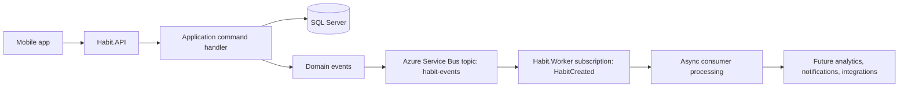

# Habitoo

Habitoo is a mobile-first habit tracking monorepo with an Ionic/Angular client and a .NET backend organized around CQRS-style application layering and asynchronous event processing.

The repository already contains the foundation for an event-driven backend, but the product is still in an in-progress state:

- The mobile app currently runs with mocked authentication and local habit persistence.
- The main API and background worker are real .NET services.
- Azure Service Bus is already wired into the backend event flow.
- Analytics, notifications, and Azure Functions projects are present, but they are still scaffold-level services.

## Repository layout

```text
habit-tracker-api/
├── README.md
└── src/
    ├── Habitoo.sln
    ├── Mobile/
    │   └── Habitoo/
    │       ├── package.json
    │       └── src/
    │           ├── app/
    │           │   ├── core/
    │           │   ├── features/
    │           │   └── shared/
    │           ├── global.scss
    │           └── theme/
    └── Services/
        ├── Habit.API/
        ├── Habit.Worker/
        ├── Analytic.API/
        ├── Notifications.Worker/
        └── Habit.Functions/
```

## Current implementation status

### Mobile app

- Built with Angular 20, Ionic 8, and Capacitor 8.
- Uses standalone components.
- Uses `@capacitor/preferences` for mocked session persistence.
- Uses local storage for mocked habit state.
- Includes a modern login flow, daily home view, habit creation modal, and an insights screen with Chart.js visualizations.
- Does not yet consume the backend API.

### Backend

- Built on .NET 9.
- Main HTTP entry point is `Habit.API`.
- Main asynchronous consumer is `Habit.Worker`.
- Messaging uses Azure Service Bus topic publishing and subscription-based processing.
- The backend already separates `Application`, `Domain`, and `Infrastructure` concerns.
- Some services in the solution are still placeholders and should be documented as such, not treated as production-ready bounded contexts.

## Architecture overview

### Monorepo structure

- `src/Mobile/Habitoo`: Ionic/Angular client.
- `src/Services/Habit.API`: core habits API and composition root.
- `src/Services/Habit.Worker`: background consumer for asynchronous habit events.
- `src/Services/Analytic.API`: scaffold API, currently still template-level.
- `src/Services/Notifications.Worker`: scaffold worker, currently still template-level.
- `src/Services/Habit.Functions`: scaffold Azure Functions project.

### Backend style

The current backend is best described as a layered, event-driven foundation:

- HTTP writes enter through `Habit.API` minimal endpoints.
- Commands are handled through MediatR in the application layer.
- Aggregates and notifications live in the domain layer.
- Persistence and messaging adapters live in infrastructure.
- After a successful write, the API is prepared to publish domain events to Azure Service Bus.
- `Habit.Worker` subscribes to the `habit-events` topic and processes events asynchronously.

### Event-driven flow



### Important architectural notes

- `Habit.API` is the real backend center of gravity today.
- `Habit.Worker` is the active asynchronous runtime for message handling.
- `Analytic.API`, `Notifications.Worker`, and `Habit.Functions` should currently be treated as extension points, not complete product services.
- An `Infrastructure/Outbox` folder exists in `Habit.API`, but a persisted outbox flow is not implemented yet.
- The API command pipeline publishes whatever exists in `habit.DomainEvents`, but the current aggregate implementation still needs stronger domain-event emission to make the async pipeline fully effective.

## Service breakdown

### Habit.API

Purpose:
Core HTTP service for habit commands and queries.

Highlights:

- ASP.NET Core minimal endpoints.
- MediatR command handling.
- FluentValidation pipeline behaviors.
- EF Core with SQL Server for writes.
- Dapper available for read-side queries.
- Azure Service Bus publisher.
- Serilog, OpenTelemetry, Swagger, and health checks.

Primary responsibilities:

- Accept habit-related HTTP requests.
- Validate requests and coordinate domain operations.
- Persist aggregate state.
- Publish integration-relevant events after successful writes.

### Habit.Worker

Purpose:
Dedicated asynchronous consumer for backend events.

Highlights:

- Hosted background service.
- Azure Service Bus processor.
- Manual message completion and dead-letter handling.
- Health checks and structured logging.

Primary responsibilities:

- Subscribe to the `habit-events` topic.
- Process `HabitCreated` messages.
- Isolate asynchronous work away from synchronous HTTP request latency.

### Analytic.API

Purpose:
Reserved analytics-facing service boundary.

Current state:
Template API only. Not yet integrated into the core flow.

### Notifications.Worker

Purpose:
Reserved background boundary for outbound notifications and reminder orchestration.

Current state:
Template worker only. Consumers and services folders are present but not implemented.

### Habit.Functions

Purpose:
Reserved Azure Functions entry point for cloud-triggered workflows.

Current state:
Sample blob-trigger function only. Not yet part of the main local development loop.

## Frontend experience

The current mobile experience is intentionally optimized for fast UI iteration.

## User stories

### Product stories

- As a user, I want to sign in quickly and resume where I left off, so that habit tracking feels immediate instead of administrative.
- As a user, I want to create a habit with a name, schedule context, and type, so that I can model both simple and measurable routines.
- As a user, I want to track habits in Morning, Afternoon, and Evening buckets, so that my list matches the flow of my day.
- As a user, I want to mark habits complete or update measurable progress with immediate feedback, so that small wins feel visible and motivating.
- As a user, I want an insights screen that shows completion trends and consistency patterns, so that I can understand how stable my routine really is.
- As a user, I want my local progress to survive reloads while the backend integration is still under construction, so that the prototype remains usable day to day.

### Backend and system stories

- As the platform, I want habit writes to be handled through application commands, so that validation, business rules, and persistence stay centralized.
- As the platform, I want backend events to be published to Azure Service Bus after successful writes, so that follow-up work can happen asynchronously.
- As the platform, I want a dedicated worker to consume habit events, so that analytics, notifications, and future integrations do not block the HTTP request path.
- As an operator, I want health checks, structured logging, and traces in the core services, so that failures in the API or worker can be diagnosed quickly.
- As the architecture evolves, I want analytics, notifications, and functions to become separate execution boundaries, so that the monorepo can grow without collapsing everything into one service.

## Tech stack

### Frontend

- Angular 20
- Ionic 8
- Capacitor 8
- Chart.js
- chartjs-chart-matrix
- RxJS

### Backend

- .NET 9
- ASP.NET Core minimal APIs
- MediatR
- FluentValidation
- EF Core 9 with SQL Server
- Dapper
- Azure Service Bus
- Serilog
- OpenTelemetry

## Local development

## Prerequisites

- Node.js 20 or newer
- npm
- .NET 9 SDK
- SQL Server reachable at `localhost,1433` or an equivalent connection string override
- Azure Service Bus connection string for the backend event pipeline
- Optional: Seq at `http://localhost:5341` if you want structured log aggregation

## Restore dependencies

```bash
dotnet restore src/Habitoo.sln
cd src/Mobile/Habitoo
npm install
```

## Run the mobile app

```bash
cd src/Mobile/Habitoo
npm start
```

Expected local URL:

- `http://localhost:4200`

## Run the core backend API

```bash
dotnet run --project src/Services/Habit.API/Habit.API.csproj
```

Expected local URLs:

- `http://localhost:5012`
- `https://localhost:7142`

Swagger UI is exposed at the application root in development.

## Run the asynchronous worker

```bash
dotnet run --project src/Services/Habit.Worker/Habit.Worker.csproj
```

This worker expects the `ServiceBus` connection string from `src/Services/Habit.Worker/appsettings.Development.json` or an environment override.

## Optional scaffold services

These projects exist in the solution but are not yet part of the main product loop:

```bash
dotnet run --project src/Services/Analytic.API/Analytic.API.csproj
dotnet run --project src/Services/Notifications.Worker/Notifications.Worker.csproj
dotnet run --project src/Services/Habit.Functions/Habit.Functions.csproj
```

Use them as scaffolds while the architecture evolves, not as fully integrated services.

## Configuration notes

### Habit.API

Development configuration currently expects:

- `ConnectionStrings:SqlServer`
- `ConnectionStrings:ServiceBus`
- `Seq:ServerUrl`

### Habit.Worker

Development configuration currently expects:

- `ConnectionStrings:ServiceBus`
- `Seq:ServerUrl`

## Current gaps and next architecture steps

- Raise and persist domain events more consistently from the aggregates.
- Implement a real outbox to guarantee reliable event publication.
- Replace mocked mobile auth and local habit state with API-backed flows.
- Turn `Notifications.Worker`, `Analytic.API`, and `Habit.Functions` into real bounded execution paths.
- Close the loop between frontend actions, backend persistence, and asynchronous downstream processing.

## Summary

Habitoo is already more than a UI prototype, but it is not yet a fully integrated product. The mobile app is currently optimized for UX iteration, while the backend has the beginnings of a serious event-driven architecture centered on `Habit.API` and `Habit.Worker`. The next meaningful step is to connect the frontend to the backend and harden the event pipeline with proper domain-event emission and an outbox implementation.