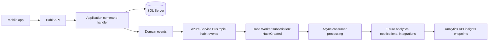
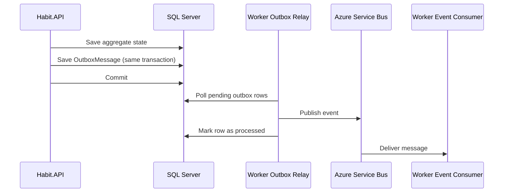

# Habitoo

Habitoo is a mobile-first habit tracking monorepo with an Ionic/Angular client and a .NET backend organized around CQRS-style application layering and asynchronous event processing.

The repository already contains the foundation for an event-driven backend, but the product is still in an in-progress state:

- The mobile app currently runs with mocked authentication and local habit persistence.
- The main API and background worker are real .NET services.
- Azure Service Bus is already wired into the backend event flow.
- Analytics, notifications, and Azure Functions projects are present, but they are still scaffold-level services.

## Repository layout

```text
habit-tracker-api/
├── README.md
└── src/
    ├── Habitoo.sln
    ├── Mobile/
    │   └── Habitoo/
    │       ├── package.json
    │       └── src/
    │           ├── app/
    │           │   ├── core/
    │           │   ├── features/
    │           │   └── shared/
    │           ├── global.scss
    │           └── theme/
    └── Services/
        ├── Habit.API/
        ├── Habit.Worker/
        ├── Analytics.API/
        ├── Notifications.Worker/
        └── Habit.Functions/
```

## Current implementation status

### Mobile app

- Built with Angular 20, Ionic 8, and Capacitor 8.
- Uses standalone components.
- Uses `@capacitor/preferences` for mocked session persistence.
- Uses local storage for mocked habit state.
- Includes a modern login flow, daily home view, habit creation modal, and an insights screen with Chart.js visualizations.
- Does not yet consume the backend API.

### Backend

- Built on .NET 9.
- Main HTTP entry point is `Habit.API`.
- Main asynchronous consumer is `Habit.Worker`.
- Messaging uses Azure Service Bus topic publishing and subscription-based processing.
- The backend already separates `Application`, `Domain`, and `Infrastructure` concerns.
- Some services in the solution are still placeholders and should be documented as such, not treated as production-ready bounded contexts.

## Architecture overview

### Monorepo structure

- `src/Mobile/Habitoo`: Ionic/Angular client.
- `src/Services/Habit.API`: core habits API and composition root.
- `src/Services/Habit.Worker`: background consumer for asynchronous habit events.
- `src/Services/Analytics.API`: reserved insights API for analytics-oriented read models.
- `src/Services/Notifications.Worker`: scaffold worker, currently still template-level.
- `src/Services/Habit.Functions`: scaffold Azure Functions project.

### Clean Architecture in practice

`Habit.API` follows a pragmatic Clean Architecture style with explicit layer boundaries and dependency direction.

| Layer | Main folders | Responsibility | Depends on |
| --- | --- | --- | --- |
| Presentation | `Apis/Endpoints`, `Apis/Middleware` | HTTP transport, endpoint contracts, API-level error mapping | Application |
| Application | `Application/*` | Use-case orchestration, MediatR handlers, CQRS commands/queries, pipeline behaviors | Domain |
| Domain | `Domain/*` | Business rules, aggregates, value objects, domain notifications/events | No outer layer |
| Infrastructure | `Infrastructure/*` | EF Core, repositories, Dapper, Service Bus, health checks, security adapters | Application/Domain abstractions |

Concrete wiring in code:

- `Program.cs` composes the app through `AddApplication()` and `AddInfrastructure()`.
- `Application/Extensions/ApplicationExtensions.cs` registers MediatR and cross-cutting behaviors (`LoggingBehavior`, `ValidationBehavior`).
- `Infrastructure/Extensions/InfrastructureExtensions.cs` configures SQL Server, repositories, Service Bus publisher, and health checks.
- `Infrastructure/Data/AppDbContext.cs` implements `IUnitOfWork`, preserving transaction ownership behind an application abstraction.

### DDD tactical design and rich-domain direction

The project already includes several DDD tactical patterns that are useful for study.

Aggregate roots and entities:

- `Domain/Entities/HabitAggregate/Habit.cs` (aggregate root)
- `Domain/Entities/UserAggregate/User.cs` (aggregate root)
- `Domain/Entities/HabitAggregate/HabitLog.cs` (child entity)

Value objects:

- `Domain/ValueObjects/HabitName.cs`
- `Domain/ValueObjects/Frequency.cs`
- `Domain/ValueObjects/UserName.cs`
- `Domain/ValueObjects/Email.cs`

Persistence mapping reinforces DDD semantics by using EF Core owned types:

- `Infrastructure/Data/Configurations/HabitConfiguration.cs`
- `Infrastructure/Data/Configurations/UserConfiguration.cs`

Domain validation and invariants:

- Aggregate factories and behaviors use a Notification pattern (`Domain/Notifications/Notification.cs`) to accumulate business-rule violations without relying on exception flow for expected cases.

Rich-domain status (important study note):

- The model has a rich-domain shape (behavior methods + value objects + domain events).
- There is an intentional improvement area: `CreateHabitCommandHandler` publishes `habit.DomainEvents`, but `Habit` currently does not call `RaiseDomainEvent(...)` in key transitions.
- `User` keeps a separate private `_domainEvents` list and should be aligned to the `Entity.DomainEvents` pipeline for consistency across aggregates.

### Event-driven flow



### Outbox pattern implementation track using the existing worker

Current state:

- `CreateHabitCommandHandler` commits to SQL Server and then calls `IServiceBusPublisher`.
- This is a good first event-driven step, but it is not a transactional outbox yet.

Why move to Outbox:

- Without outbox, a crash between commit and publish can lose integration events.
- Outbox makes persistence and event registration atomic.

Recommended study design for this repo:



How the current worker helps:

- Keep the existing `Habit.Worker` consumer path for business-event processing.
- Add an outbox relay hosted service (same worker project or dedicated worker) that publishes pending rows.
- This keeps the architecture event-driven while adding delivery reliability.

Suggested outbox table for the study path:

```sql
CREATE TABLE OutboxMessages (
    Id UNIQUEIDENTIFIER NOT NULL PRIMARY KEY,
    AggregateType NVARCHAR(150) NOT NULL,
    AggregateId UNIQUEIDENTIFIER NOT NULL,
    EventType NVARCHAR(200) NOT NULL,
    Payload NVARCHAR(MAX) NOT NULL,
    OccurredOnUtc DATETIME2 NOT NULL,
    ProcessedOnUtc DATETIME2 NULL,
    Error NVARCHAR(2000) NULL,
    RetryCount INT NOT NULL DEFAULT 0
);

CREATE INDEX IX_OutboxMessages_Pending
ON OutboxMessages (ProcessedOnUtc, OccurredOnUtc)
WHERE ProcessedOnUtc IS NULL;
```

Implementation checklist:

1. Add an `OutboxMessage` entity and EF mapping in `Infrastructure/Outbox`.
2. Persist aggregate changes and outbox rows in the same `IUnitOfWork.CommitAsync` transaction.
3. Implement a relay process in worker runtime that publishes outbox rows in batches.
4. Mark rows as processed, store retry metadata, and dead-letter poison payloads.
5. Add idempotency keys and observability metrics for pending/failed/published counts.

### Important architectural notes

- `Habit.API` is the real backend center of gravity today.
- `Habit.Worker` is the active asynchronous runtime for message handling.
- `Analytics.API`, `Notifications.Worker`, and `Habit.Functions` should currently be treated as extension points, not complete product services.
- An `Infrastructure/Outbox` folder exists in `Habit.API`, but a persisted outbox flow is not implemented yet.
- The API command pipeline publishes whatever exists in `habit.DomainEvents`, but the current aggregate implementation still needs stronger domain-event emission to make the async pipeline fully effective.
- The worker is the natural place to evolve into an Outbox Relay + Event Consumer runtime for resilient delivery.

## Service breakdown

### Habit.API

Purpose:
Core HTTP service for habit commands and queries.

Highlights:

- ASP.NET Core minimal endpoints.
- MediatR command handling.
- FluentValidation pipeline behaviors.
- EF Core with SQL Server for writes.
- Dapper available for read-side queries.
- Azure Service Bus publisher.
- Serilog, OpenTelemetry, Swagger, and health checks.

Primary responsibilities:

- Accept habit-related HTTP requests.
- Validate requests and coordinate domain operations.
- Persist aggregate state.
- Publish integration-relevant events after successful writes.

### Habit.Worker

Purpose:
Dedicated asynchronous consumer for backend events.

Highlights:

- Hosted background service.
- Azure Service Bus processor.
- Manual message completion and dead-letter handling.
- Health checks and structured logging.

Primary responsibilities:

- Subscribe to the `habit-events` topic.
- Process `HabitCreated` messages.
- Isolate asynchronous work away from synchronous HTTP request latency.

### Analytics.API

Purpose:
Insights-facing API boundary for analytical queries and projections.

Current state:
Template API only. Not yet integrated into the core flow.

Target responsibility:

- Expose read-focused endpoints for consistency trends, streak summaries, completion curves, and other insight views.
- Consume projections produced from asynchronous habit events rather than coupling the mobile insights screen directly to the write model.
- Become the natural backend for replacing the current mocked insights experience in the mobile app.

### Notifications.Worker

Purpose:
Reserved background boundary for outbound notifications and reminder orchestration.

Current state:
Template worker only. Consumers and services folders are present but not implemented.

### Habit.Functions

Purpose:
Reserved Azure Functions entry point for cloud-triggered workflows.

Current state:
Sample blob-trigger function only. Not yet part of the main local development loop.

## Frontend experience

The current mobile experience is intentionally optimized for fast UI iteration.

## User stories

### Product stories

- As a user, I want to sign in quickly and resume where I left off, so that habit tracking feels immediate instead of administrative.
- As a user, I want to create a habit with a name, schedule context, and type, so that I can model both simple and measurable routines.
- As a user, I want to track habits in Morning, Afternoon, and Evening buckets, so that my list matches the flow of my day.
- As a user, I want to mark habits complete or update measurable progress with immediate feedback, so that small wins feel visible and motivating.
- As a user, I want an insights screen that shows completion trends and consistency patterns, so that I can understand how stable my routine really is.
- As a user, I want my local progress to survive reloads while the backend integration is still under construction, so that the prototype remains usable day to day.

### Backend and system stories

- As the platform, I want habit writes to be handled through application commands, so that validation, business rules, and persistence stay centralized.
- As the platform, I want backend events to be published to Azure Service Bus after successful writes, so that follow-up work can happen asynchronously.
- As the platform, I want a dedicated worker to consume habit events, so that analytics, notifications, and future integrations do not block the HTTP request path.
- As an operator, I want health checks, structured logging, and traces in the core services, so that failures in the API or worker can be diagnosed quickly.
- As the architecture evolves, I want analytics, notifications, and functions to become separate execution boundaries, so that the monorepo can grow without collapsing everything into one service.
- As a user, I want my insights screen to come from a dedicated analytics API, so that trend computation and dashboard queries stay optimized for read scenarios.

## Tech stack

### Frontend

- Angular 20
- Ionic 8
- Capacitor 8
- Chart.js
- chartjs-chart-matrix
- RxJS

### Backend

- .NET 9
- ASP.NET Core minimal APIs
- MediatR
- FluentValidation
- EF Core 9 with SQL Server
- Dapper
- Azure Service Bus
- Serilog
- OpenTelemetry

## Local development

## Prerequisites

- Node.js 20 or newer
- npm
- .NET 9 SDK
- SQL Server reachable at `localhost,1433` or an equivalent connection string override
- Azure Service Bus connection string for the backend event pipeline
- Optional: Seq at `http://localhost:5341` if you want structured log aggregation

## Restore dependencies

```bash
dotnet restore src/Habitoo.sln
cd src/Mobile/Habitoo
npm install
```

## Run the mobile app

```bash
cd src/Mobile/Habitoo
npm start
```

Expected local URL:

- `http://localhost:4200`

## Run the core backend API

```bash
dotnet run --project src/Services/Habit.API/Habit.API.csproj
```

Expected local URLs:

- `http://localhost:5012`
- `https://localhost:7142`

Swagger UI is exposed at the application root in development.

## Run the asynchronous worker

```bash
dotnet run --project src/Services/Habit.Worker/Habit.Worker.csproj
```

This worker expects the `ServiceBus` connection string from `src/Services/Habit.Worker/appsettings.Development.json` or an environment override.

## Optional scaffold services

These projects exist in the solution but are not yet part of the main product loop:

```bash
dotnet run --project src/Services/Analytics.API/Analytics.API.csproj
dotnet run --project src/Services/Notifications.Worker/Notifications.Worker.csproj
dotnet run --project src/Services/Habit.Functions/Habit.Functions.csproj
```

Use them as scaffolds while the architecture evolves, not as fully integrated services.

## Configuration notes

### Habit.API

Development configuration currently expects:

- `ConnectionStrings:SqlServer`
- `ConnectionStrings:ServiceBus`
- `Seq:ServerUrl`

### Habit.Worker

Development configuration currently expects:

- `ConnectionStrings:ServiceBus`
- `Seq:ServerUrl`

## Current gaps and next architecture steps

- Align all aggregates to a single domain-event mechanism (`Entity.DomainEvents`) and remove divergent event lists.
- Raise events directly from aggregate behavior methods to reinforce a rich domain model.
- Implement a real outbox and relay flow to guarantee reliable event publication.
- Replace mocked mobile auth and local habit state with API-backed flows.
- Turn `Notifications.Worker`, `Analytics.API`, and `Habit.Functions` into real bounded execution paths.
- Close the loop between frontend actions, backend persistence, and asynchronous downstream processing.

## Summary

Habitoo is already more than a UI prototype, but it is not yet a fully integrated product. The mobile app is currently optimized for UX iteration, while the backend has the beginnings of a serious event-driven architecture centered on `Habit.API`, `Habit.Worker`, and a future `Analytics.API` read boundary. The next meaningful step is to connect the frontend to the backend, harden the event pipeline with proper domain-event emission and an outbox implementation, and feed real insight projections through the analytics service.